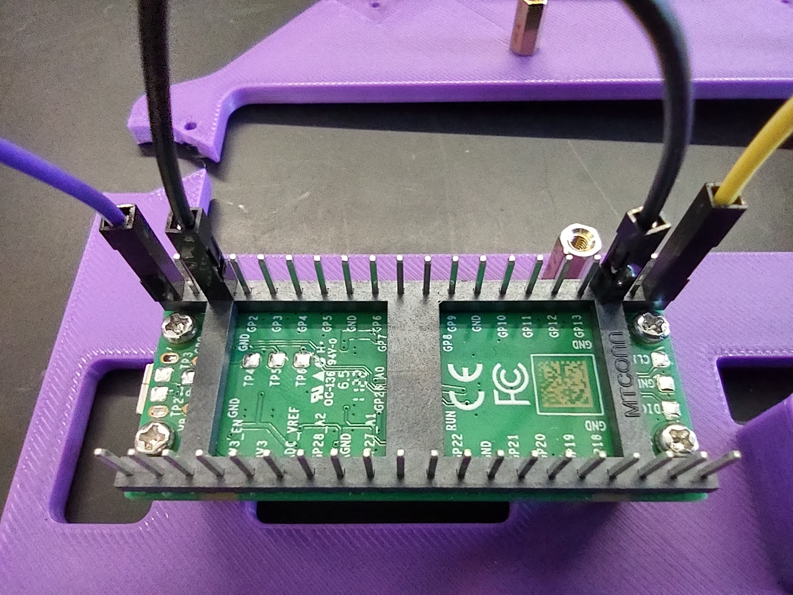
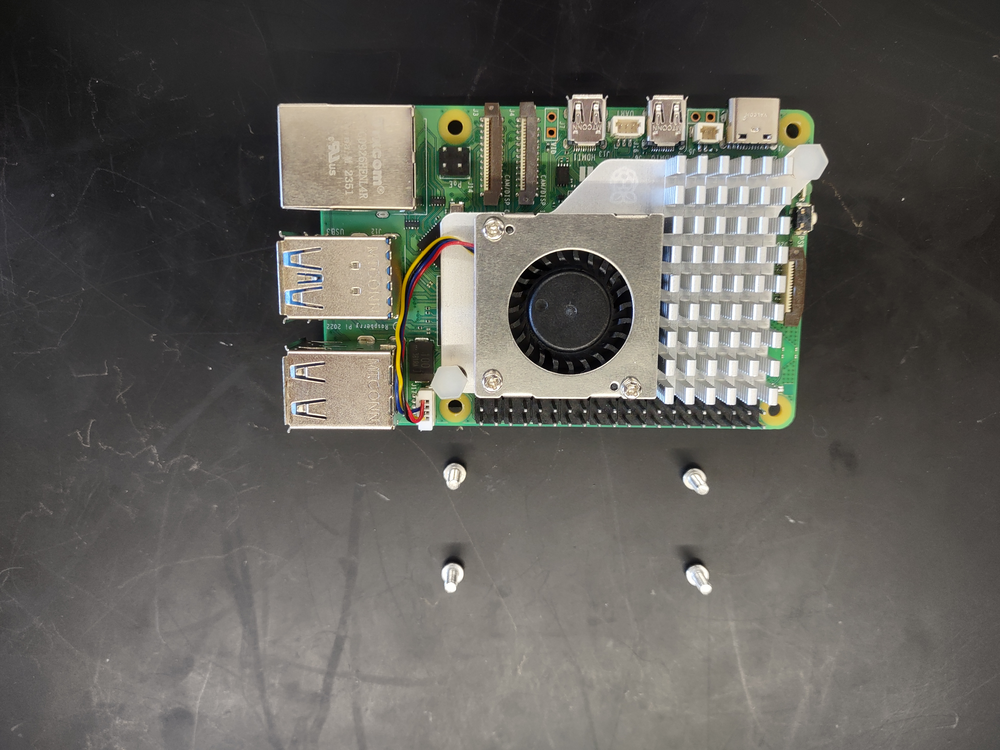
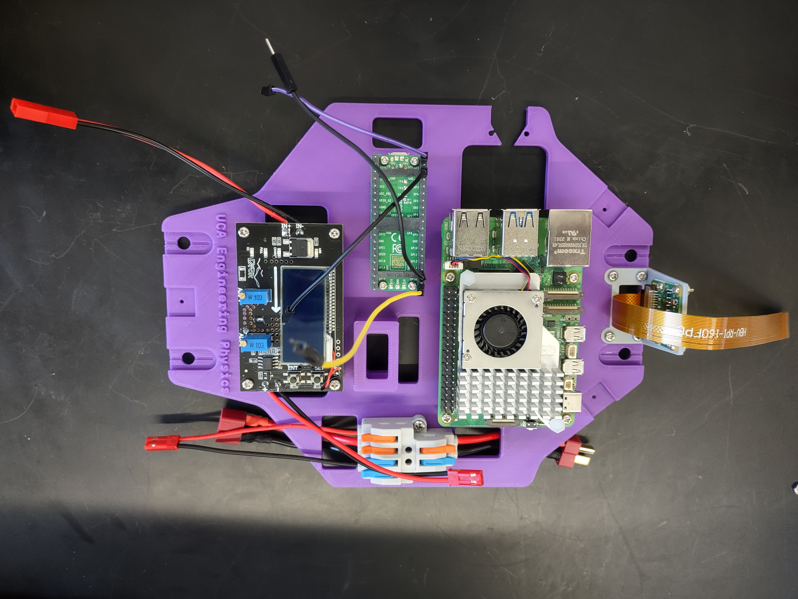
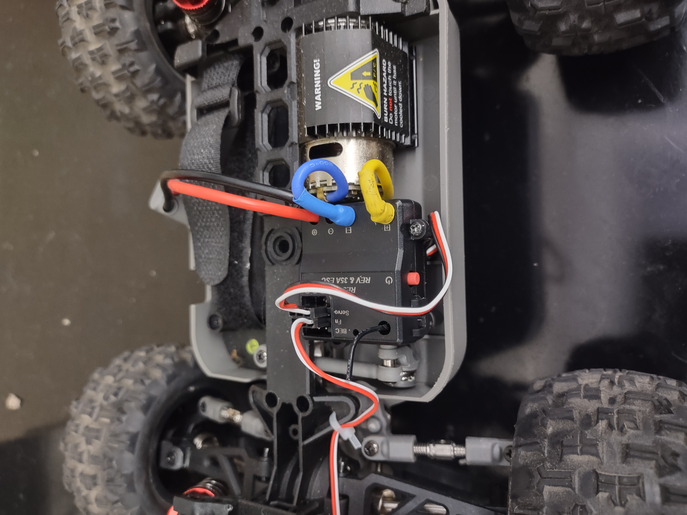
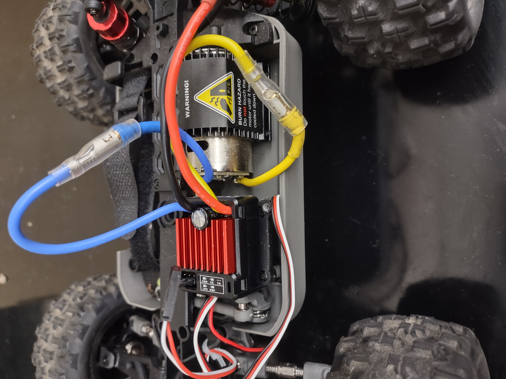
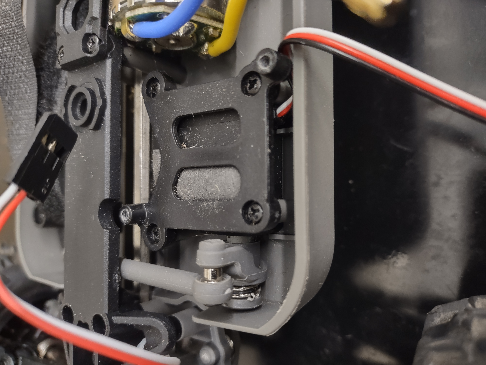
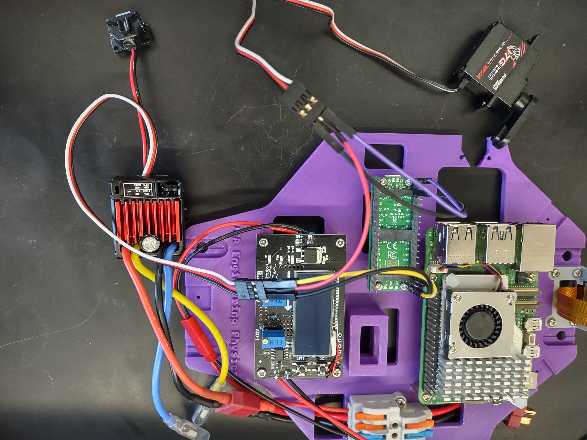

# Hardware Assembly Guide
We recommend you to follow the following order to assemble your BearCart.

## 1 Standoffs
| Item                          | Qty.  |
| :---                          | :---  |
| Male M2.5*15 standoff         | 8     |
| M2.5 nut                      | 8     |
| Female M2*15 standoff         | 4     |
| M2*6 screw                    | 4     |

There are pockets at the bottom side of the bed. 
Place nuts or screws into those pockets and tighten the standoffs by hands.

## 2 Camera
| Item                    | Qty.  |
| :---                    | :---  |
| 3D-Printed camera mount | 1     |
| RPi Camera module       | 1     |
| CSI **camera** cable        | 1     |
| M2.5*6 screw            | 2-4   |
| M2.5 nut                | 2-4   |
| M2*6 screw              | 2-4   |
| M2 nut                | 2-4   |

### 2.1 Install Camera Mount on Bed

### 2.2 Install Pi Camera

## 3 Wire Splitter
| Item                             | Qty.  |
| :---                             | :---  |
| Wire splitter                    | 1     |
| M2.5*16 screw                    | 2     |
| M2.5 nut                         | 2     |
| Female T-plug connector w/ wires | 1     |
| Male T-plug connector w/ wires   | 1     |
| Female JST connector w/ wires    | 1     |

## 4 Buck Converter
| Item                          | Qty.  |
| :---                          | :---  |
| Step-Down (BUCK) converter    | 1     |
| M2.5*6 screw                  | 4     |
| Male JST connector w/ wires   | 1     |
| Female JST connector w/ wires | 1     |

**Note the arrow pointing direction below the LCD screen**

## 5 Pico
| Item                              | Qty.  |
| :---                              | :---  |
| RPi Pico                          | 1     |
| M2*6 screw                        | 2-4   |
| Male-to-Male Dupont jumper wire   | 1     |
| Male-to-Female Dupont jumper wire | 4     |
| Micro-USB to USB-A cable          | 1     |
| Double-Sided tape                 | 1     |

Pico's `GP0`, `GP15` and 2 `GND` pins will be employed later to control the ESC and the servo motor. Please refer to the [Wiring Guide](wiring.md) for more details.

## 6 Raspberry Pi
| Item                              | Qty.  |
| :---                              | :---  |
| Raspberry Pi 5                    | 1     |
| M2.5*6 screw                      | 2-4   |

## 7 Replace ESC
| Item                     | Qty.  |
| :---                     | :---  |
| QuicRun 1060 brushed ESC | 1     |
| M2*6 screw               | 2     |
| M2 nut                   | 2     |
| Double-Sided tape        | 2     |

1. Unplug motor power wires (blue and yellow) from the stock ESC.

2. Plug the motor power wires to blue and yellow wires on the new ESC

3. The new ESC can be seated on top of the servo motor.

4. Wire up ESC, servo motor and Pico

For a more detailed guide on wiring, please go to the [Wiring Guide](wiring.md) page.

