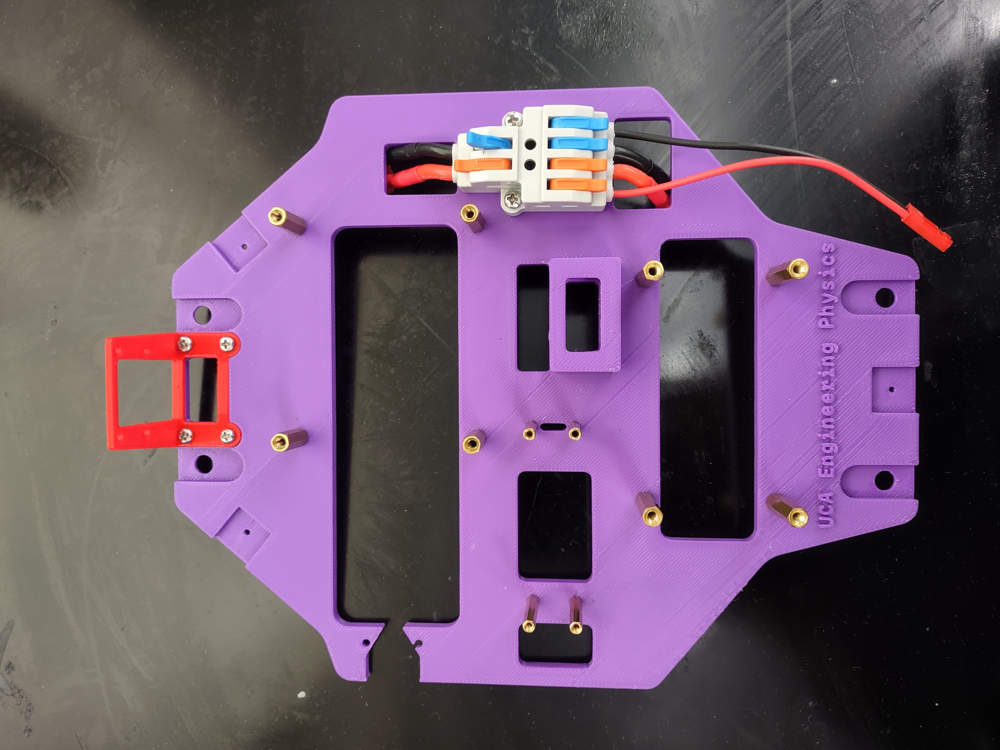
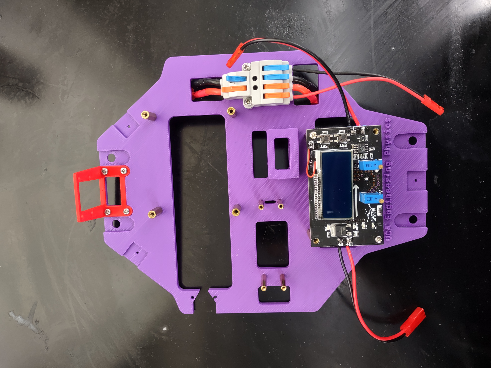
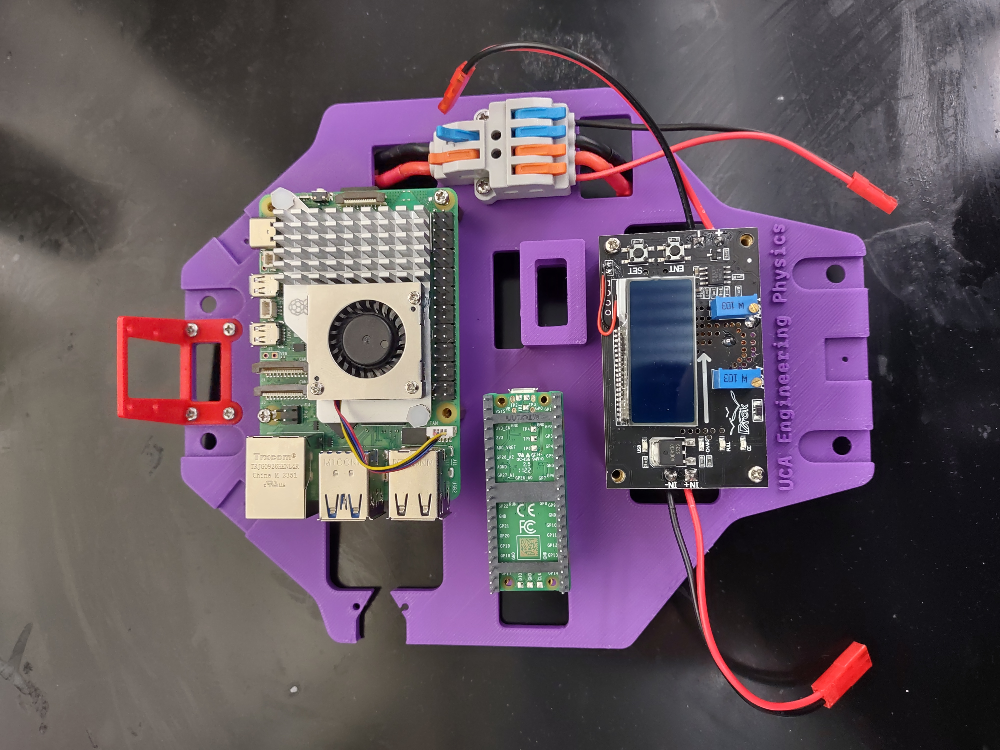

# Hardware Assembly Guide

## Wire Splitter
| Item                          | Qty.  |
| :---                          | :---  |
| Wire splitter                 | 1     |
| M2.5*10 screw                 | 2     |
| M2.5 nut                      | 2     |
| Wired female T-plug connector | 1     |
| Wired male T-plug connector   | 1     |
| Female JST connector wires    | 1     |

## Camera
| Item                    | Qty.  |
| :---                    | :---  |
| 3D-Printed camera mount | 1     |
| RPi Camera module       | 1     |
| CSI **camera** cable        | 1     |
| M2.5*4 screw            | 2-4   |
| M2.5 nut                | 2-4   |
| M2*4 screw              | 2-4   |
| M2.5 nut                | 2-4   |

## Standoffs
| Item                          | Qty.  |
| :---                          | :---  |
| M2.5*20 standoff              | 4     |
| M2.5*10 standoff              | 4     |
| M2.5 nut                      | 8     |
| M2*15 standoff                | 4     |
| M2 nut                        | 4     |

## Buck Converter
| Item                          | Qty.  |
| :---                          | :---  |
| M2.5 screw                    | 4     |
| Male JST connector wires      | 2     |

## Pico, ESC & Servo
| Item                              | Qty.  |
| :---                              | :---  |
| M2 screw                          | 2-4   |
| Male-to-Male Dupont jumper wire   | 1     |
| Male-to-Female Dupont jumper wire | 4     |
| Micro-USB to USB-A cable          | 1     |
| Double-Sided tape                 | 1     |

## Raspberry Pi
| Item                              | Qty.  |
| :---                              | :---  |
| M2.5 screw                        | 2-4   |

