# Hardware Assembly Guide
We recommend you to follow the following order to assemble your BearCart.

## 1 Standoffs
| Item                          | Qty.  |
| :---                          | :---  |
| Male M2.5*15 standoff         | 8     |
| M2.5 nut                      | 8     |
| Female M2*15 standoff         | 4     |
| M2*6 screw                    | 4     |

There are pockets at the bottom side of the bed. 
Place nuts or screws into those pockets and tighten the standoffs by hands.

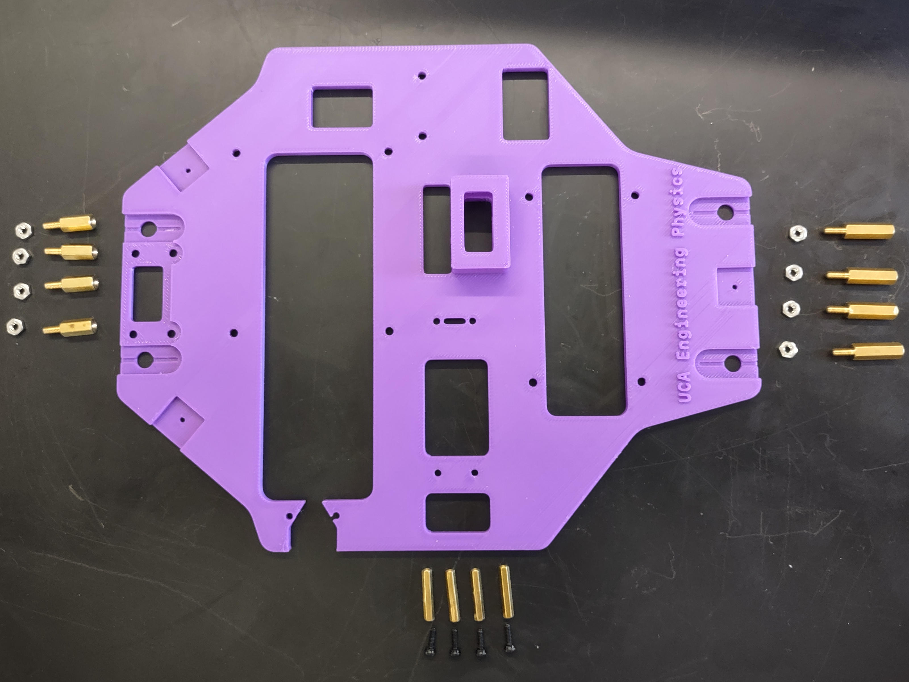
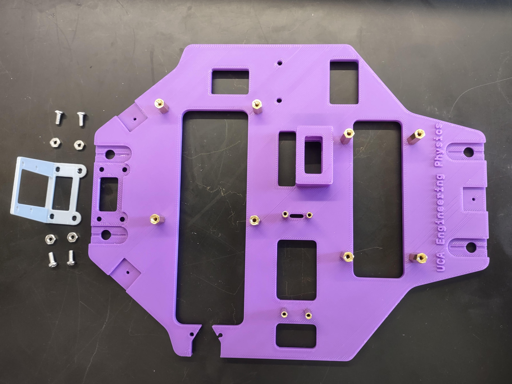

## 2 Camera
| Item                    | Qty.  |
| :---                    | :---  |
| 3D-Printed camera mount | 1     |
| RPi Camera module       | 1     |
| CSI **camera** cable        | 1     |
| M2.5*6 screw            | 2-4   |
| M2.5 nut                | 2-4   |
| M2*6 screw              | 2-4   |
| M2 nut                | 2-4   |

### 2.1 Install Camera Mount on Bed

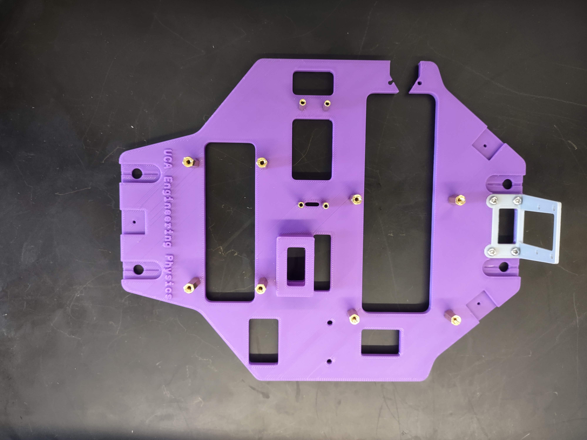

### 2.2 Install Pi Camera
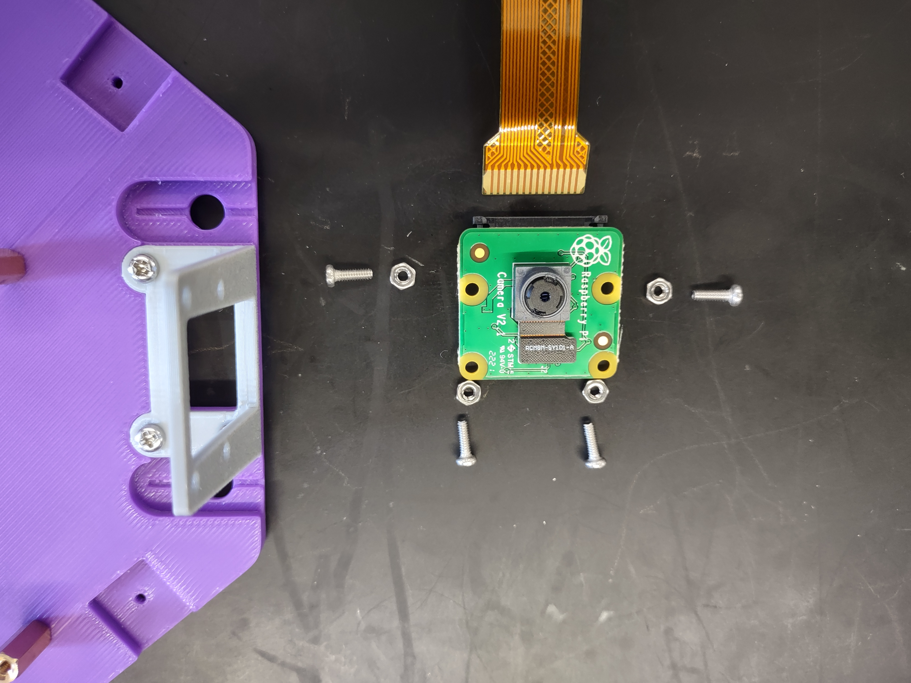
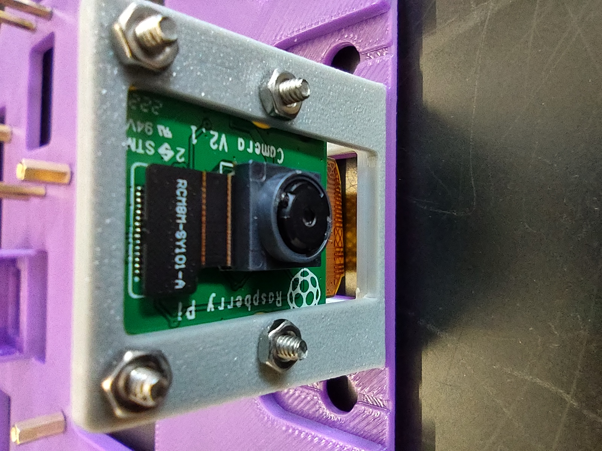
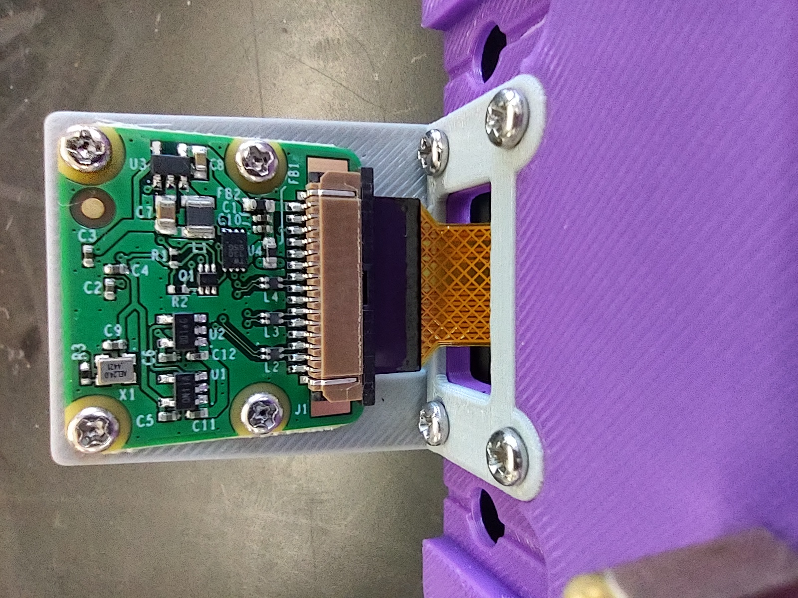

## 3 Wire Splitter
| Item                             | Qty.  |
| :---                             | :---  |
| Wire splitter                    | 1     |
| M2.5*16 screw                    | 2     |
| M2.5 nut                         | 2     |
| Female T-plug connector w/ wires | 1     |
| Male T-plug connector w/ wires   | 1     |
| Female JST connector w/ wires    | 1     |

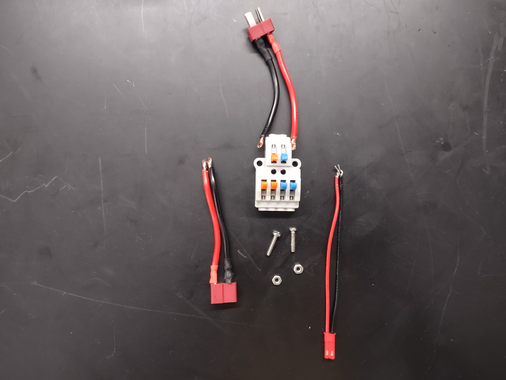
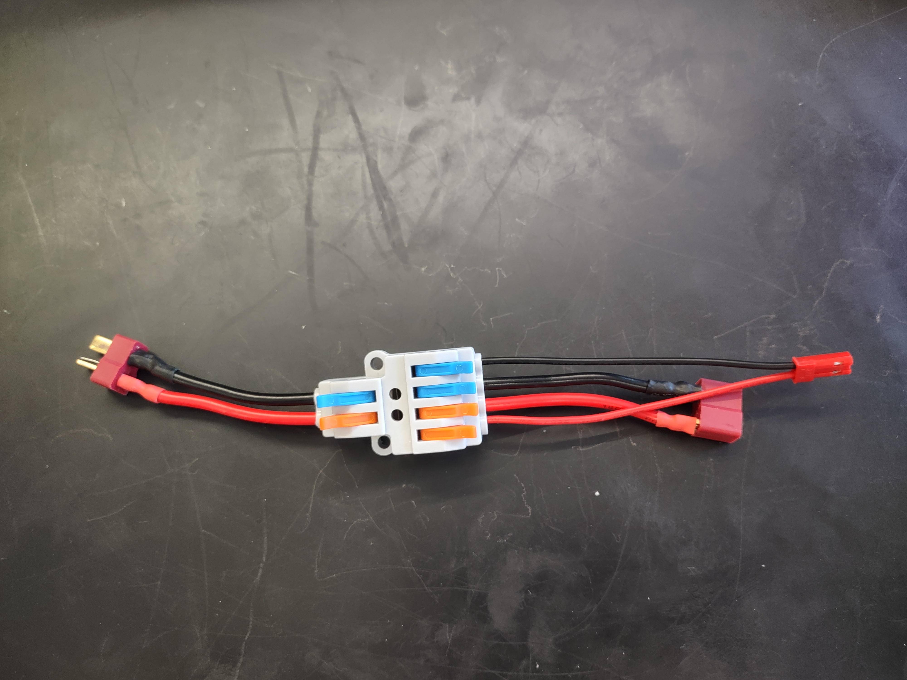
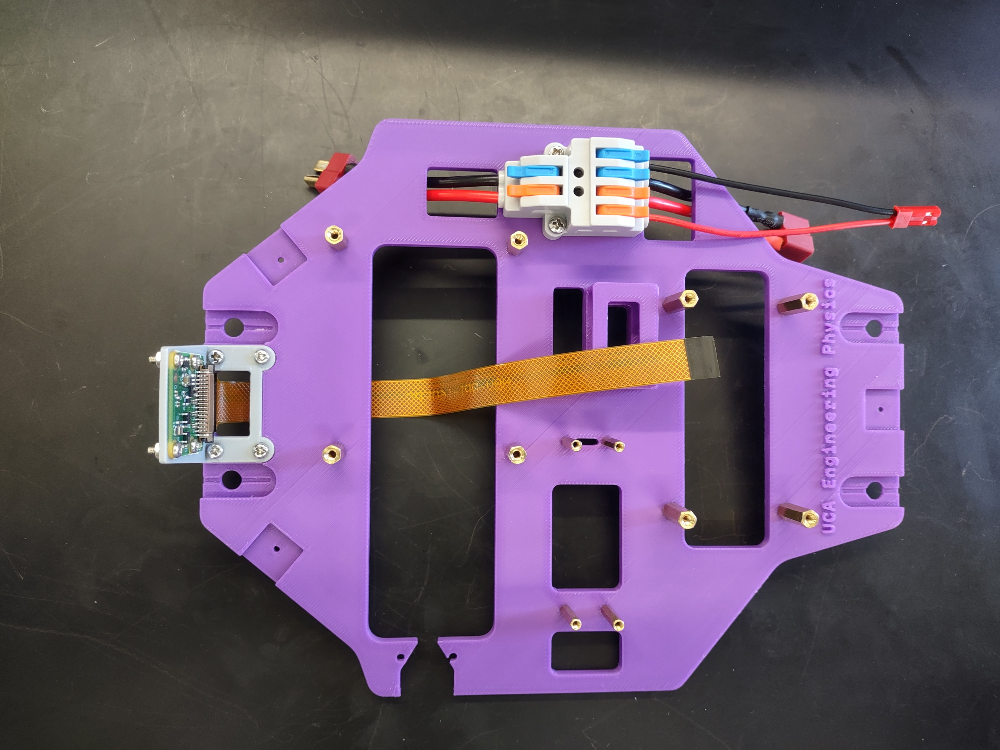

## 4 Buck Converter
| Item                          | Qty.  |
| :---                          | :---  |
| M2.5 screw                    | 4     |
| Male JST connector w/ wires   | 1     |
| Female JST connector w/ wires | 1     |

**Note the arrow pointing direction below the LCD screen**

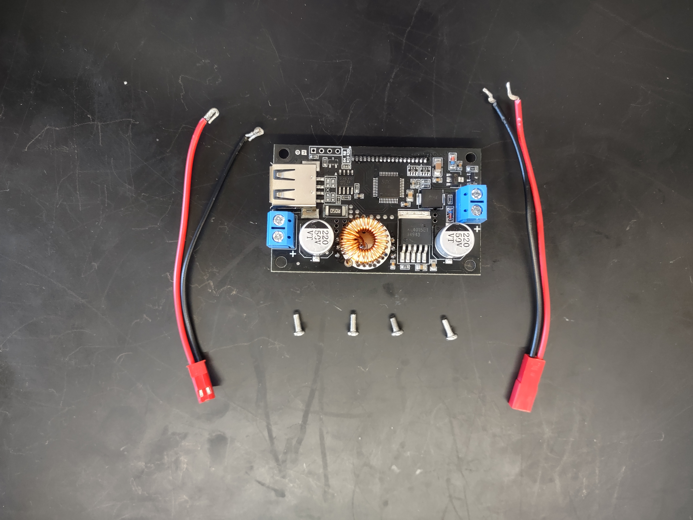
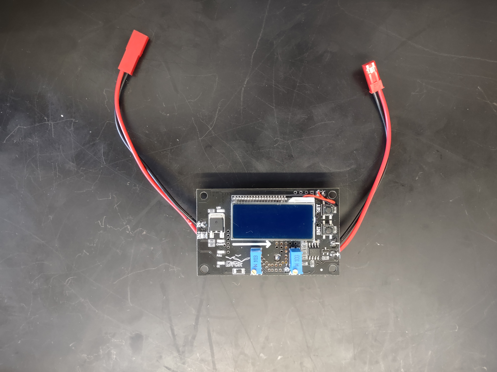
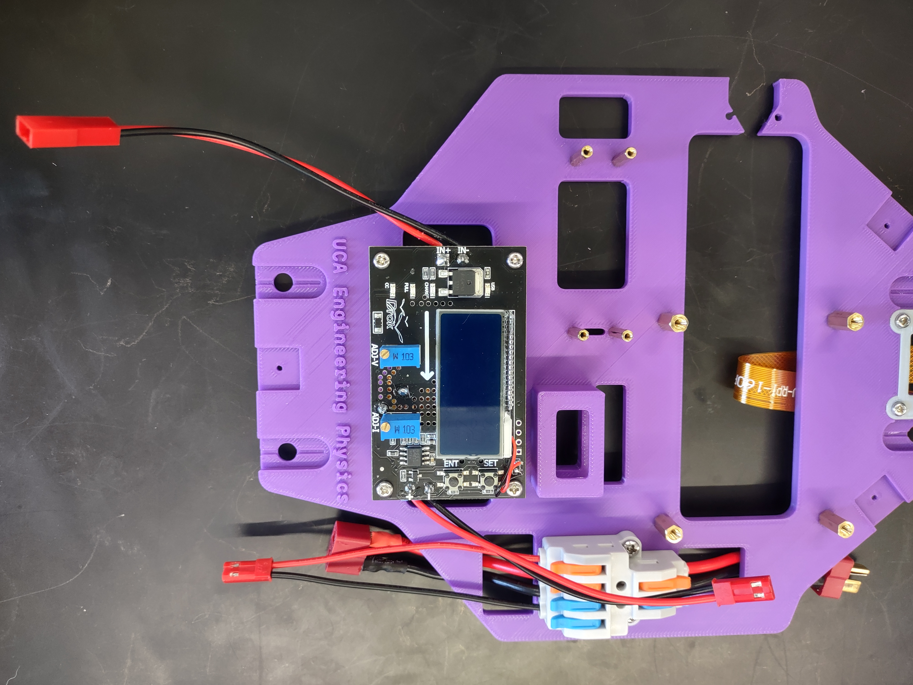

## Pico, ESC & Servo
| Item                              | Qty.  |
| :---                              | :---  |
| M2 screw                          | 2-4   |
| Male-to-Male Dupont jumper wire   | 1     |
| Male-to-Female Dupont jumper wire | 4     |
| Micro-USB to USB-A cable          | 1     |
| Double-Sided tape                 | 1     |

## Raspberry Pi
| Item                              | Qty.  |
| :---                              | :---  |
| M2.5 screw                        | 2-4   |

