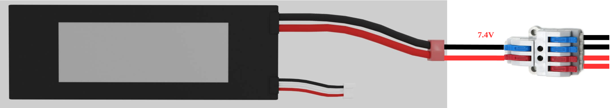
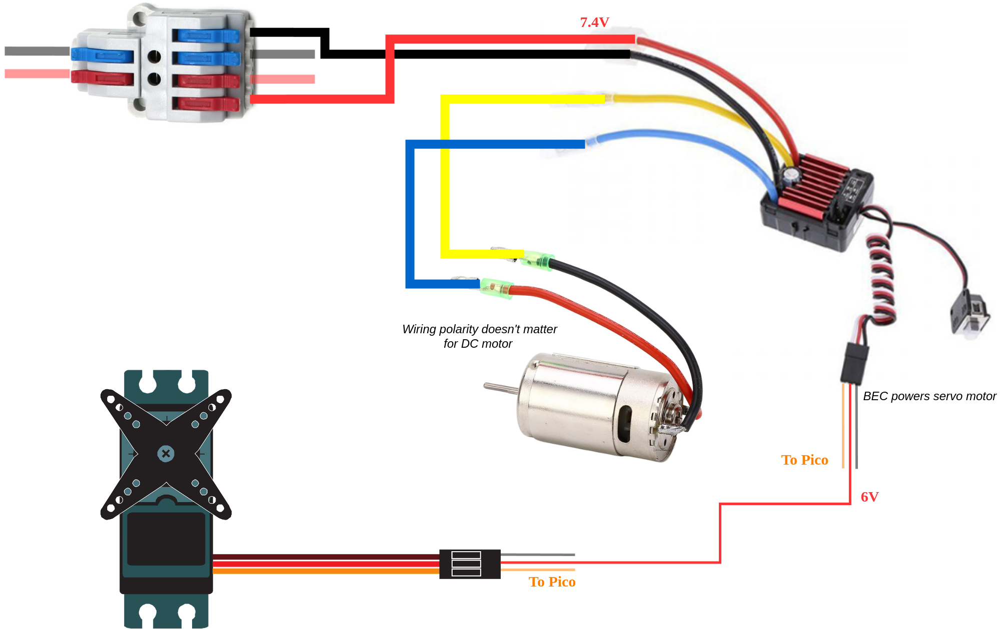

# Electric Wiring Guide
**Color coding the positive and negative power lines is extremely recommended.**

## 1 Split Battery Power
The LiPo battery will provide power for all the electric components. 
A wire splitter is employed to separate the power for the drivetrain from the power for the computing devices.

## 2 Powering Drivetrain
The Electronic Speed Controller (ESC) is in charge of regulate the speed and direction of the main engine (a DC motor), as well as providing power to the steering system (a servo motor) through a Battery Eliminator Circuit (BEC).

The ESC and the servo motor can receive signals through their JST connectors.
There are two widely used color codes for these connections.

## 3 Powering Up Motor Driver
**Pay attention to the polarity of the power port (labeled with "+" and "-")**

## 4 Powering Up Raspberry Pi
- A Raspberry Pi can be powered up from a '5V' (positive) and a 'GND' (negative) pin among the GPIO pins.
- **Apply a power source over 5 volts may damage the Raspberry Pi.**

## 5 GPIO Wiring
- Raspberry Pi is in charge of controlling the steering servo and thrust motor.
- The control signals are handled by some of the GPIO pins.
- The GPIO pins employed as shown in the diagram below are the default setting.
Other GPIO pins can be used.

## TODO
- LED wiring

